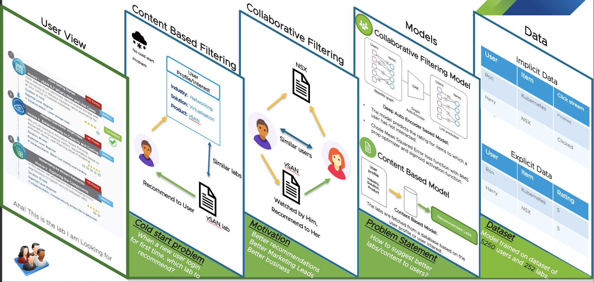
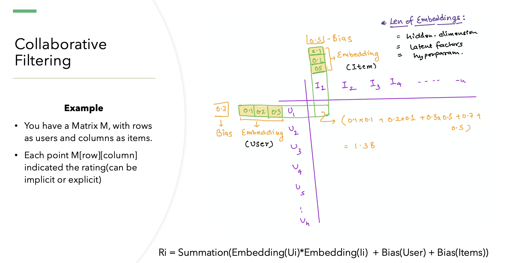
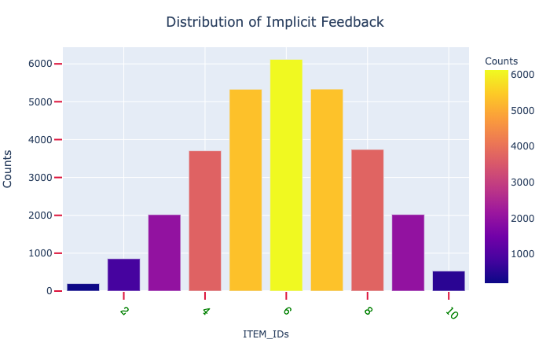
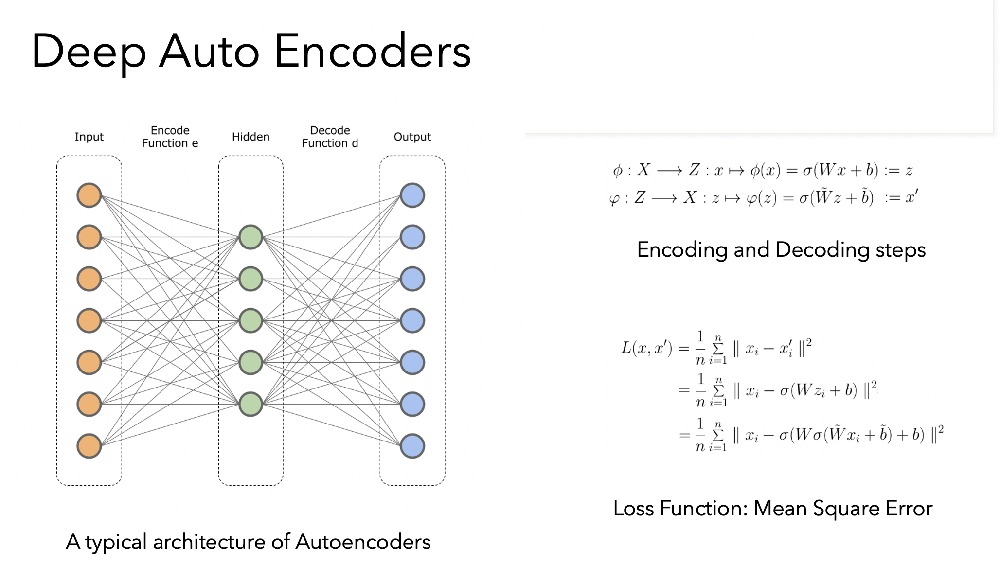

# Recommendation Systems

AutoEncoders Based Recommendation System 
This project is based on building a recommendation system based on Deep learning based methods. This repo contains Autoencoders based learning framework to recommend top 10 items for a specific provided user.

## Layers Underneath:


In the above you can see that while the user see the relevant content, but there are several hidden layers behind the scene. We can visualize these layers as the following steps:
* The first step is to solve the cold start problem, where when a user logs in for the first time, then what recommendations to show. In that case it make sense to recommend the content based on the profile of the user. so we maintain a profile of a user and then based on that user profile we can look for similar labs from the database.

* The second step is the collaborating filtering to find correlations between different users. To understand the collborating filtering better consider the follwowing figure:



The main problem in collaborating filtering is that we have a sparse matrix of size m*n or users_len*items_len, because usually any user interact with few of the items in the catalog. so the goal of the collaborating filtering is to fill the sparse matrix with the ratings. For each user we would like to prdict what would be the rating that this user will give for all the items in the catalog, and this is where the model needs to learn the embeddings for user and items. Using these embeddings/weights one can easily predict the ratings of the user of items as shown in the  above figure. You can think of these embeddings as the learning the weights for each genres in a movie(hidden features). 

* The third step is the implementation of these algorithms, for cold start it can be a simple lookup on database. for collaborating filtering Auto encoders can be used to learn these latent features and then using those weights we can predict the rating and complete the sparse matrix.

* The final layer in the figure 1 is data layer, which is the most crucial. The data can be categorize into 2 parts: Implicit feedback which can be in the form of clickstream data and the other one is the explicit rating which a user give once he or she finshed evaluating the item/product/movie.


#### Data:

The data used for this project is genereted synthetically. all the userids, rating, and itemids are generated synthetically. To have a good mixture of interaction the feedback is sampled from a normally distributed data, and the typical graph for it looks like this:



The reason to do that to have a good mixture of all the rating. These ratings can be interpreted either as implicit feedback data(like a clickstream data) or as explicit(ratings provided by users explicitly)

There are total 5000+ users and 252 product_ids. Since this data is not a lot, any ML based algorithms like svd,knn, etc will work well.

#### Dependencies:

To install all the project dependencies, please run:
```

pip install -r requirements.txt

```

### Directory structure:

This repo contains the following directory structure:
deep-learning/data ==> all csv files should be here
deep-learning/model ==> model definition is written here
	model/autoencoders.py ==> model definition
	model/train_model.py ==> evaluation metrics definitoins
deep-learning/preprocess_data.py ==> this contains the preprocessing of data. It varies from synthetically generating datapoints, to normalize data, divide the data into train, validation, and test sets.
deep-learning/train.py ==> this contains the main code to run the training for the model


### The Model:


It is a simplistic Auto Encoders based model as shown the above figure with:
* 2 encoder and 2 decoder layers
* Sigmoid functio at outpur layer to get the probabilistic output.
* Loss function used is Mean Square Error.
* Optimizer used for regularization is ADAM. You can try other as well like RMSprop,etc.


#### Hyperparameter:

```

args = {
	'epochs':50,
	'learning_rate':2e-3,
	'batch_size':64,
	'l2_reg':False,
	'lambda_value':0.01,
	'input_size':252,
	'hidden_dim1':128,
	'hidden_dim2':64,
	'train_data_size':200
}

```

You can adjust these hypereparameters to tune the model more accurately.


### Train the model:

To train the model simply run:

```
cd deep-learning
python train.py

```

The output should look like:

```
============
Epoch : 1
============
Train error: 1.5576547754777443 || Validation error: 1.4711113996338772
============
Epoch : 2
============
Train error: 1.5225750103190139 || Validation error: 1.4570075812492562
============
Epoch : 3
============
Train error: 1.5150998307240975 || Validation error: 1.4545075721020162
============
Epoch : 4
============
Train error: 1.5124895757920034 || Validation error: 1.4522907999160264
============
Epoch : 5
============
Train error: 1.50946706533432 || Validation error: 1.4519942571722035
============
Epoch : 6
============
Train error: 1.5079724981978133 || Validation error: 1.4479610284334004
============
Epoch : 7
============
Train error: 1.504904461068076 || Validation error: 1.4444621093951029
============
Epoch : 8
============
Train error: 1.5038418584578745 || Validation error: 1.4449347356752453
============
Epoch : 9
============
Train error: 1.5031312373844352 || Validation error: 1.444345810070406
============
Epoch : 10
============
Train error: 1.5014506908687386 || Validation error: 1.4420791728544855
--------------------------------------------------------------------------
Test error 1.9924600295060275

Training done, Please enter the User name to show recommendations : nle
Top 10 recommendations for the user: nle are :
                    ITEM_ID  PROB_RECOM(Probability)
835926  HOL-2002-02-CMP-HOL    1.000000
835934  HOL-2004-01-SDC-HOL    1.000000
835912  HOL-2001-01-CMP-HOL    0.934366
835923  HOL-2001-91-ISM-HOL    0.815368
836094  HOL-2081-01-HBD-HOL    0.367434
835931  HOL-2003-01-NET-HOL    0.325930
835983  HOL-2013-01-ISM-HOL    0.000783
836033  HOL-2037-01-NET-HOL    0.000479
836093  HOL-2080-01-ISM-HOL    0.000115
836080  HOL-2052-01-ISM-HOL    0.000060

```


[ NOTE ]: Currentely the code is not integrated to apis. so currently it runs in a demo style.


[Future Work]:

* CUDA/ GPU support to the code
* Data integration from supercollider
* Mode checkpoints save
* Hyperparameter tunning
* Implement variational encoders


## License:
MIT

